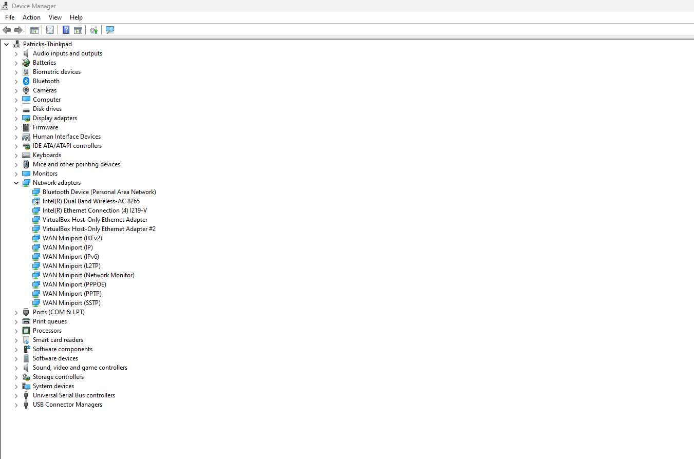
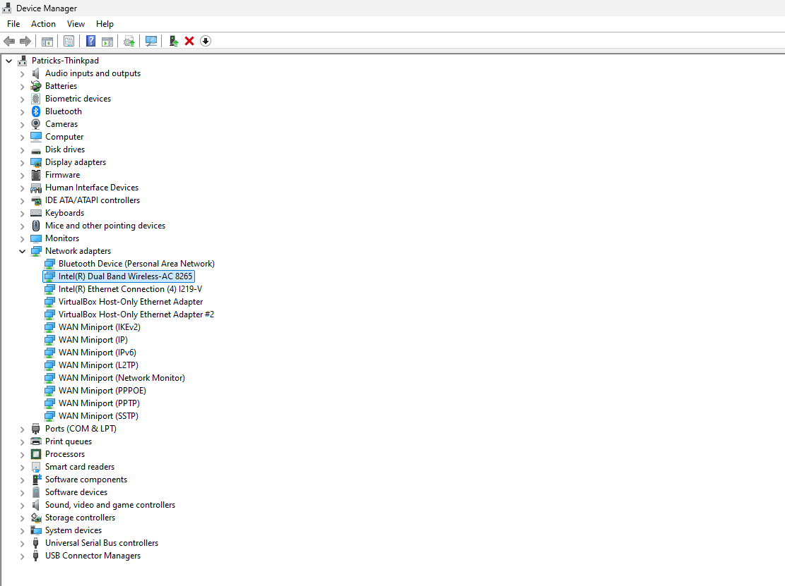
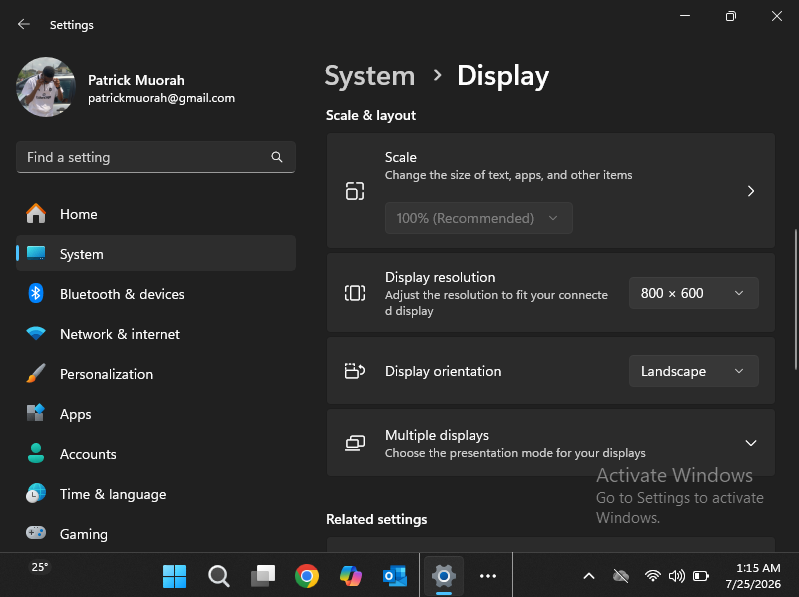
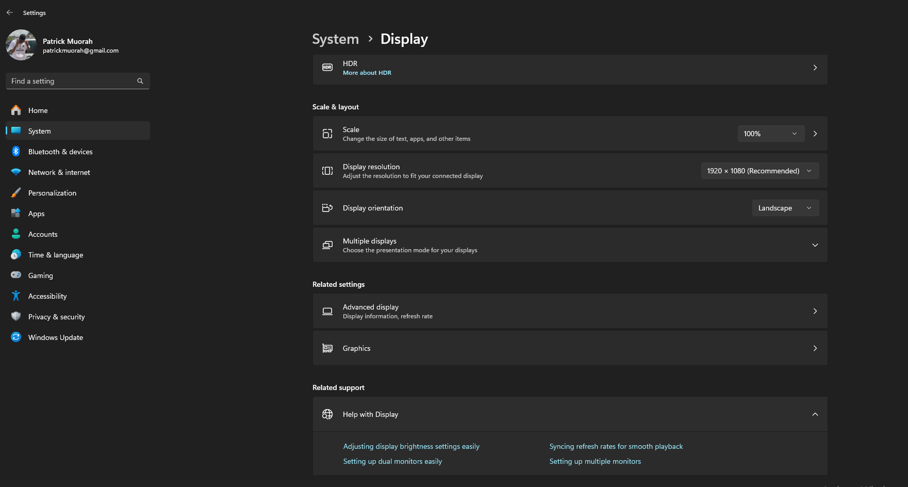

# TROUBLESHOOTING

## ISSUE 1: USER REPORTS NO NETWORK CONNECTIVITY

#### Theory: Network Adapter disabled

#### Test: Checked Device Manager and adapter showed as disabled

#### Plan: Re-enable adapter via Device Manager

#### Fix: Right-clicked adapter and enabled device

#### Outcome: Connectivity restored and ping test successful

**Screenshots:**
Broken state => Fixed state

 

## ISSUE 2: USER REPORTS DISPLAY LOOKS STRETCHED AND ICONS TOO LARGE

#### Theory: Display resolution has been changed

#### Test: Opened Display Settings - resolution set to 800xgoo instead of recommended

#### Plan: Restore resolution to recommended setting

#### Fix: Changed resolution back to 1920x1080 (Recommended)

#### Outcome: Display return to correct resolution, user confirmed normal

**Screenshots:**
Broken state => Fixed state

 

